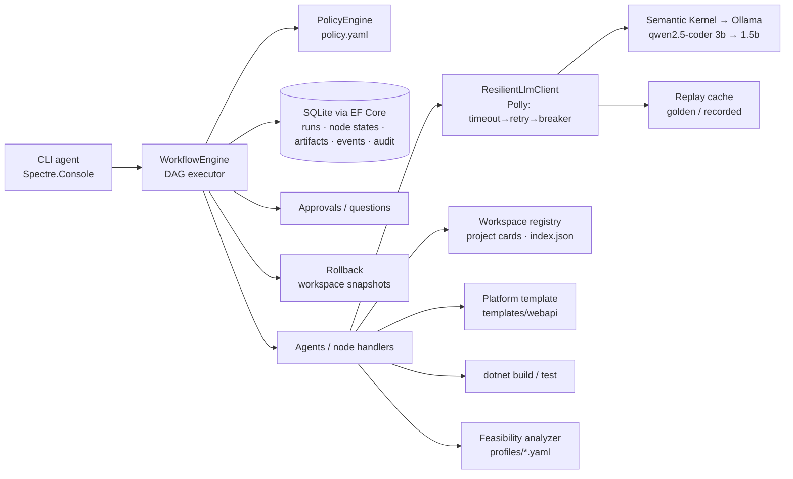
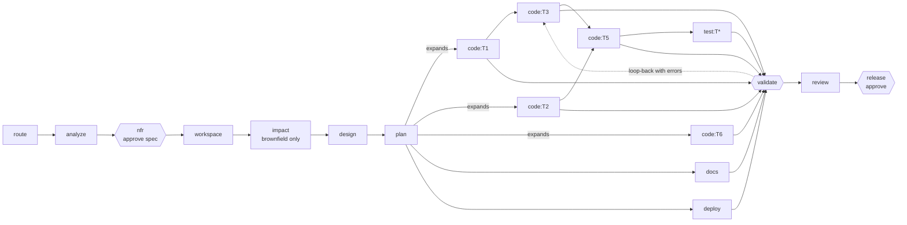

# Architecture

## 1. Problem framing
The assignment has two layers. The **orchestrator** (graded core) turns a requirement into a reviewed, released change
under governance. The **URL shortener** is the first thing it builds and later modifies — evidence that the orchestration works.

Requirement understanding is explicit: the analyst produces a typed spec (functional requirements with acceptance
criteria, assumptions, out-of-scope, ambiguities). Ambiguities go to a human; NFRs that the text doesn't state are asked
(deployment target, load, availability) or recorded as assumptions — never invented silently.

## 2. Components

| Project | Responsibility |
|---|---|
| `Orchestrator` — `Core/` | Engine, graph, gates, governance contracts, policy, audit chain, metrics, routing rules, capacity analysis, LLM abstraction. No I/O dependencies. |
| `Orchestrator` — `Infrastructure/` | EF Core stores (provider-switchable), file workspace registry + snapshots, Semantic Kernel chat model, Polly resilient LLM client, replay cache, process runner. |
| `Orchestrator` — `Agents/` | Node handlers (agents), prompts, typed artifacts, the SDLC pipeline definition. |
| `Orchestrator.Cli` | Composition root, commands, console approvals/questions, live event view. |
| `templates/webapi` | Locked "platform kit" every generated service starts from. |

## 3. Orchestration model

**Node contract** (same for every node): entry gates → handler (bounded attempts; failures and gate violations are fed
back into the next attempt) → fallback strategy (one attempt) → exit gates → policy evaluation of the node's action and
any runtime-requested actions (`auto | notify | approve | forbidden`) → `OnCommit` side effects (files are written only
after gates and approvals pass) → artifacts committed with content hash and input fingerprint.

**Non-linear, stateful execution**
- *Parallel paths with synchronisation*: ready nodes run concurrently (bounded); `@group` dependencies create joins.
- *Dynamic graph*: the planner's task list is expanded into nodes; task dependencies become edges (sequential + parallel).
- *Loop-back*: the validator attributes compiler/test/coverage/policy failures to the responsible task nodes and sends them
  back with exact errors (bounded; then one fallback pass; then safe-stop).
- *Re-planning*: each node records a fingerprint of the artifacts it read. When an upstream artifact changes (human
  revise, `agent revise`, regenerated file), stale nodes are re-queued — build-system style, only what is affected.
  A changed plan regenerates its task nodes.
- *Durability*: every state change is persisted; `agent resume` continues from where it stopped with a fresh, audited retry budget.

**Failure handling ladder**: transient LLM errors → Polly retry (backoff + jitter) → circuit breaker → fallback model →
replay cache; semantic errors → retry with feedback → node fallback → loop-back limit → **rollback** (restore the pre-run
checkpoint, or remove a half-created project) → **safe-stop** (resumable). Ctrl+C triggers the same safe-stop.

## 4. Governance
- **Human checkpoints** (policy.yaml): spec + capacity approval, brownfield modification, schema change, deployment-profile
  change, feasibility override, high-risk review findings, release. `Revise` re-runs the node with the human's feedback.
- **Policy guardrails**: protected paths, template-locked platform files, path traversal, secret patterns, dependency allowlist,
  file size and files-per-run limits, static conventions (no sync-over-async, no mutable statics, endpoints never touch
  `DbContext`, `TimeProvider` instead of `DateTime.Now`, no interpolated raw SQL), minimum coverage, template integrity.
- **Audit**: append-only, SHA-256 hash-chained log (actor, action, target, details) — approvals, decisions/ADRs, routing,
  replans, fallbacks, rollbacks, policy blocks. `agent audit --verify` detects modified or removed entries.
- **Lineage**: artifacts are versioned with producer and input fingerprint; `agent lineage` shows how an output came to be.
- **Observability**: operational logs (Serilog JSON, rolling 7 days) are separate from the audit trail; `ActivitySource`
  spans per run/node (OpenTelemetry-compatible); metrics are computed from the event stream so they cannot drift:
  run/node success rate, semantic retries, loop-backs, transient retries, circuit opens, fallbacks, rollback frequency,
  re-plans, gate failures, **MTTR**, end-to-end latency with and without human wait, per-stage latency, LLM usage.

## 5. Key decisions
| Decision | Rationale | Alternatives |
|---|---|---|
| Custom DAG engine (C#) + Semantic Kernel only for LLM calls | Gates, re-planning, rollback and governance are the graded behaviour; owning them keeps every rule visible and testable. | SK Process Framework (experimental), Microsoft Agent Framework workflows, Temporal/Elsa (heavier, still need governance on top) |
| Ollama via OpenAI-compatible endpoint | Free, local, no API key; switching to any OpenAI-compatible provider is configuration. | SK Ollama connector (alpha) |
| Deterministic capacity analysis (not LLM) | A wrong "infeasible" is as bad as a wrong "feasible"; 1M/day ≈ 12 RPS is fine on a laptop, 99.9% availability is not. | LLM judgement |
| Locked platform template + LLM writes feature code only | Small models can't reliably produce correct cross-cutting infrastructure; this shrinks the blast radius. | Fully generated projects |
| Folder per base requirement + project card index | Routing reads cards, never code; cards are refreshed from code at release and checked for staleness by source hash. | Embedding search (optional extension via `IProjectMatcher`) |
| Snapshots instead of git for versions/rollback | No runtime dependency on git; evaluator machine needs only .NET (+ Ollama). | git branches/tags |
| Replay cache keyed by prompt hash; invariant culture + LF normalisation | Deterministic, offline demos; same key on every machine. | Mocked agents |
| Interfaces for every store, cache and queue | SQLite → Postgres/SQL Server, in-memory → Redis, channel → broker by configuration/provider swap. | — |

## 6. Generated service (URL shortener) — scalability & resilience
Cache-aside on the redirect hot path; write-behind batched analytics through a bounded queue (load shedding);
random base62 codes + unique index + retry (no coordination between instances); stateless instances; per-client rate
limiting; request timeouts; cache circuit breaker degrading to the database; DB retry with backoff; health/readiness
probes; `/ops/stats` and `X-Instance-Id`; 302 redirects so analytics stay accurate; no IP addresses stored.
Database (`Sqlite|Postgres`) and cache (`Memory|Redis`) are configuration switches. Deployment profiles (`local`,
`kubernetes`) carry capacity envelopes and strategies; for Kubernetes the orchestrator generates
Deployment/Service/HPA/PDB/ConfigMap manifests and checks probes, resource limits, immutable tags, HPA bounds and secret handling.

## 7. Risks & assumptions
- LLM output is untrusted: it never reaches the workspace before gates pass, platform files are locked, and every release needs approval.
- Curated replay responses are human-reviewed artefacts and are labelled as such in the cache files and run output (`replay:golden`).
- Single-host orchestrator; concurrency is bounded and SQLite writes are serialised.
- See README §7 for the full limitation list.
